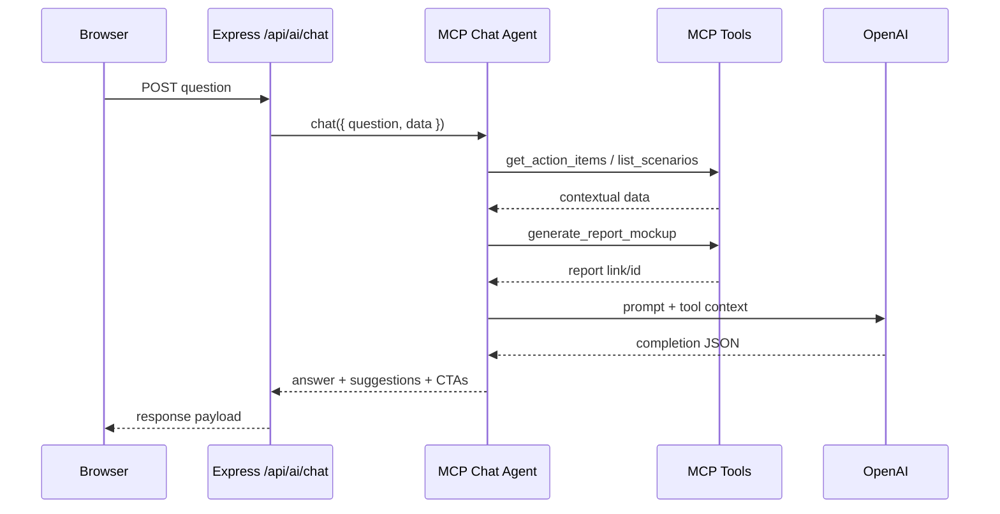

# MCP Integration Overview

## Architecture
- **Tooling Layer**: `lib/scenarioStore.js` validates scenario data; `mcp/scenarioTools.js` wraps it as MCP tools (`list_scenarios`, `get_scenario`, `get_action_items`). `mcp/actionTools.js` exposes `generate_report_mockup`. These run in-process with the Express server.
- **Agent**: `mcp/chatAgent.js` spins up an in-memory MCP server/client pair. The server registers the tools above; the client calls them on demand (e.g., when the user asks for follower lists or reports) and feeds the results into the OpenAI prompt. The agent also post-processes the completion to add smart CTAs and formatting.
- **API Endpoint**: `/api/ai/chat` delegates entirely to the MCP agent, so the React app doesn’t know about MCP. Logging in `server.js` shows each question + CTA metadata for debugging.

### Architecture Diagram
```mermaid
flowchart LR
    subgraph Frontend (React)
        UI[Ask AI Panel]
    end
    subgraph Backend (Express)
        API[/ /api/ai/chat /]
        Agent[MCP Chat Agent]
        subgraph MCP Server
            Tools[[Scenario & Action Tools]]
        end
        Data[(data/*.json)]
    end

    UI -->|question| API --> Agent
    Agent <--> Tools
    Tools -->|read/write| Data
    Agent -->|OpenAI prompt| OpenAI[(OpenAI API)]
    Agent -->|answer + CTAs| API --> UI
```

### Call Flow (Report Request)


## Benefits
- **Authoritative Data**: The agent re-fetches scenarios/action items from disk before answering. Switching scenarios or editing JSON data instantly affects responses without requiring the browser to send fresh payloads.
- **Tool-Oriented Actions**: MCP tools let the chatbot trigger server-side workflows (e.g., `generate_report_mockup`) and return links/CTAs the browser never had. This is the foundation for future actions like sending notices or running analytics.
- **Extensibility**: Adding new tools (e.g., listing scenarios, generating statements) doesn’t require changes to the React client. The agent orchestrates everything server-side.
- **Observability & Safety**: Logged CTA/suggestion metadata and validation-tested tools mean we can reason about what the agent is doing, and catch malformed data before it hits the model.

## Demo Queries
Use these in the Ask AI panel to showcase MCP-driven behavior:

| Prompt | What MCP Does | UI Result |
| --- | --- | --- |
| **"Who should we follow up with?"** | Calls `get_action_items` for the active scenario. | Answer lists delinquent borrowers pulled server-side; adds "Message [Borrower]" CTA.
| **"Generate a detailed report for this scenario."** | Calls `generate_report_mockup` to mint a mock link. | New "Open Statement Report" CTA with link appears under the response.
| **"List all available scenarios with descriptions."** | Calls `list_scenarios` and annotates the active one. | Answer starts with a bulleted scenario list showing names/descriptions/[active] tags.
| **"Open a borrower statement for this dataset."** | Calls `generate_report_mockup` with `borrower_statement`. | CTA links to a statement-style mock report tailored to the current scenario.
| **"Compare money in vs money out over the last quarter."** | Refreshes historical data before prompting OpenAI. | Chart/answer reflect authoritative numbers even if the client cache is stale.
